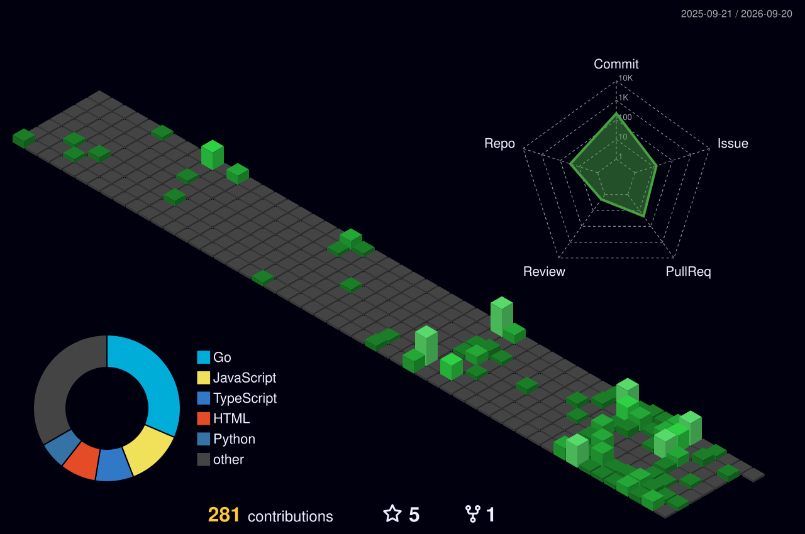

<p align="center">
  
</p>

<p align="center">
  
</p>

<p align="center">
  <a href="https://github.com/Abdullah-Builds">
    
  </a>
  <a href="mailto:khan.abdullah9753@email.com">
    
  </a>
  <a href="https://www.linkedin.com/in/abdullah-khan-718a25299">
    
  </a>
  <a href="https://leetcode.com/MuhammadAbdullahkhan99880">
    
  </a>
</p>

<p align="center">
  
  
  
</p>

---

<br>Hi there! <br>

## `> whoami`


```text
Muhammad Abdullah Khan

Backend Developer
        │
        ├── API Engineering
        ├── Go & TypeScript
        ├── AI / Agent Systems
        ├── Databases & Caching
        ├── Distributed Systems
        └── Open Source
```

I build backend systems, APIs, developer tools, and experiments around **Go, TypeScript, Python, AI agents, MCP, databases, and infrastructure**.

My GitHub is a mix of production-oriented projects, learning repositories, systems experiments, and open-source exploration.

> Build → Ship → Break → Learn → Improve

<br clear="right"/>

---

## 🛠️ Tech stack

**Languages**

<p>
  
  
</p>

**Frontend**


**Databases**

 

**DevOps**

 

**Backend**

 

**Work environment**

  

---

## Contribution Graph

<p align="center">
  
</p>

---

<p align="center">
  
</p>

---


[](https://github.com/Abdullah-Builds/Abdullah-Builds)

---

<br/>
<br/>


---

<!-- OPEN_SOURCE_START -->
## 🌍 Open Source Contributions

> A live record of my public Pull Requests, the repositories I've contributed to, and the work behind each contribution.

**Focus:** `Go` · `Backend` · `AI` · `MCP` · `Infrastructure` · `Developer Tooling`

| Repository | What I Contributed | Type | Status | PR |
|---|---|---|---|---|
| `tektronix/tm_devices` | feat:Resolved | 🔧 Engineering | 🟡 Open | [View PR →](https://github.com/tektronix/tm_devices/pull/623) |
| `oras-project/oras-go` | feat: Issue Resolved # 1305 | 🔧 Engineering | 🟡 Open | [View PR →](https://github.com/oras-project/oras-go/pull/1311) |
| `agentclash/agentclash` | feat : Fix 1238 | 🔧 Engineering | 🟡 Open | [View PR →](https://github.com/agentclash/agentclash/pull/1243) |
| `agentclash/agentclash` | feat : Resolve Issue # 1242 | 🔧 Engineering | 🟡 Open | [View PR →](https://github.com/agentclash/agentclash/pull/1244) |
| `mark3labs/mcp-go` | Fix #943: refuse unsupported subscribe requests | 🔧 Engineering | 🔵 Closed / Review | [View PR →](https://github.com/mark3labs/mcp-go/pull/946) |
| `agentclash/agentclash` | feat : Fixed Issue 1187 | 🔧 Engineering | 🔵 Closed / Review | [View PR →](https://github.com/agentclash/agentclash/pull/1228) |
| `Abdullah-Builds/AI-Incident-Response-Alert-Router` | Enhance README with technology badges and documentation | 🔧 Engineering | 🔵 Closed / Review | [View PR →](https://github.com/Abdullah-Builds/AI-Incident-Response-Alert-Router/pull/1) |
| `Abdullah-Builds/Javascript_` | Add files via upload | 🔧 Engineering | 🔵 Closed / Review | [View PR →](https://github.com/Abdullah-Builds/Javascript_/pull/2) |
| `Abdullah-Builds/Javascript_` | Add files via upload | 🔧 Engineering | 🔵 Closed / Review | [View PR →](https://github.com/Abdullah-Builds/Javascript_/pull/1) |

[View all my Pull Requests →](https://github.com/pulls?q=is%3Apr+author%3AAbdullah-Builds)
<!-- OPEN_SOURCE_END -->

---

## Let's Connect

<p align="center">
  <a href="https://github.com/Abdullah-Builds">
    
  </a>
  <a href="https://www.linkedin.com/in/abdullah-khan-718a25299">
    
  </a>
  <a href="mailto:khan.abdullah9753@email.com">
    
  </a>
</p>

<p align="center">
  <b>Backend • Go • AI Systems • Open Source • Continuous Learning</b>
</p>

<p align="center">
  
</p>


